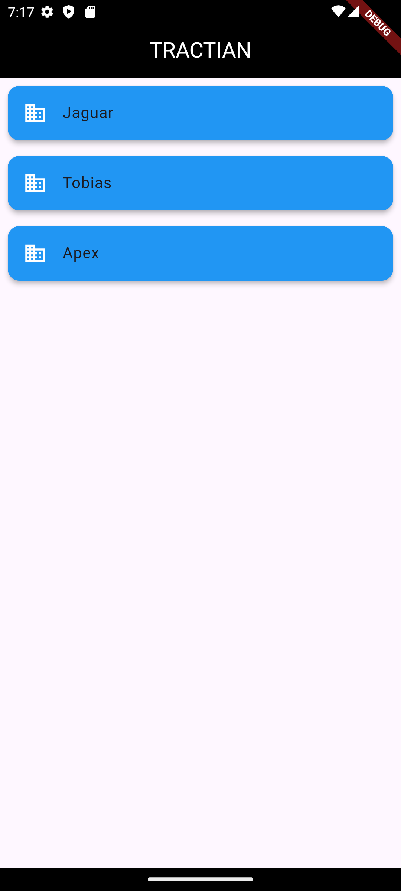

# Challenge Tractian Tela inicial
## Arquitetura

Este projeto segue intenções de uma arquitetura inspirada no padrão clean Architecture e clean code, e princípios do S.O.L.I.D.S. Ele é
dividido em camadas para separar as responsabilidades e tornar o código mais organizado e testável.
As principais camadas são:

1. **Presentation Layer**: Responsável pela exibição da interface do usuário. Utiliza widgets e
   componentes Flutter para renderizar as telas.
2. **Domain Layer**: Contém as regras de negócio.
3. **Data Layer**: Responsável por obter dados do mundo externo neste casos uma lista estática de
   das empresas.
   Utiliza o padrão Providerpara gerenciar o estado da aplicação.
## Screenhots

[Link do video](screens/tela_inicial.webm)

 

## Considerações
Posteriormente será implementados os testes unitários, goldens testes e as próximas telas;